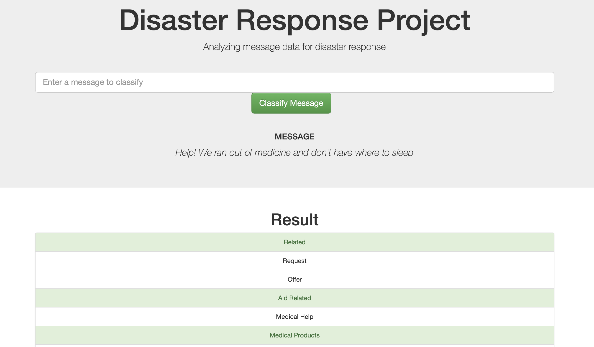
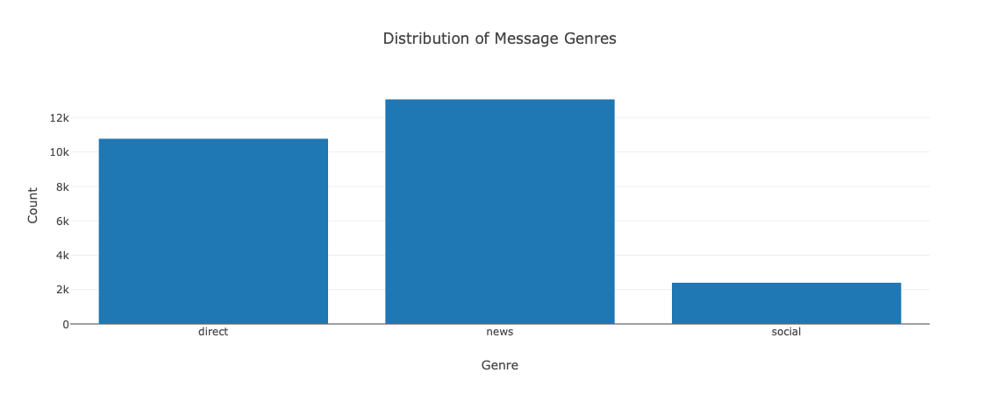
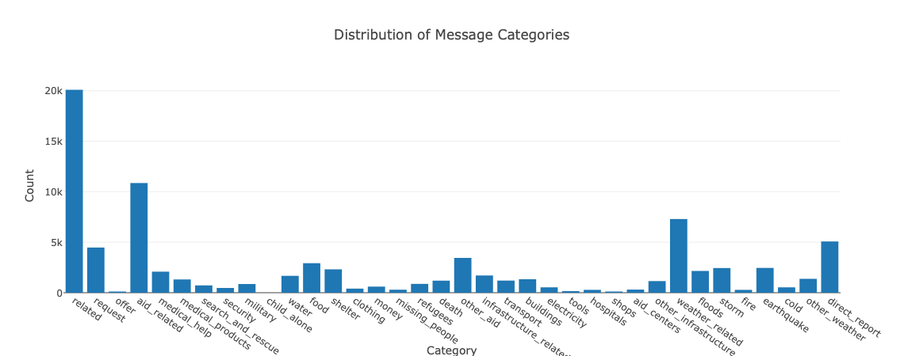

#  Udacity Data Science Nanodegree: Disaster Response Pipeline Project

## Table of Contents
1. [Project Description](#description)
2. [Getting Started](#getting_started)
	1. [Installing Dependencies](#dependencies)
	2. [Cloning This Project](#cloning)
	3. [Running the App](#running_app)
3. [Authors](#authors)
4. [License](#license)
5. [Screenshots](#screenshots)

<a name="descripton"></a>
## Description

This project's objective is to build a Natural Language Processing (NLP) model to categorize messages on real time basis.The messages used to train the model were provided by [Figure Eight](https://appen.com). and contains pre-labelled tweet and messages from real-life disaster events.

This project is divided in the following key sections:

1. **Processing data:** Creates an ETL pipeline to extract data from source, clean it and save in a SQLite DB.
2. **Training the Model:** Builds and trains a NLP pipeline to can classify text messages from various types of disasters.
3. **Running the App** Runs a web app that can classify new messaages using the trained model.

<a name="getting_started"></a>
## Getting Started

<a name="dependencies"></a>
### Dependencies
To install the dependencies
```
pip install requirements.txt
```

<a name="cloning"></a>
### Cloning This Project
To clone this git repository:
```
git clone https://github.com/PauloCK/DisasterResponsesProject.git
```
<a name="running_app"></a>
### Running the App:
1. You can run the following commands in the project's directory to set up the database, train model and save the model.

    - To run ETL pipeline to clean data and store the processed data in the database
        `python data/process_data.py data/disaster_messages.csv data/disaster_categories.csv data/disaster_responses_db.db`
    - To run the ML pipeline that loads data from DB, trains classifier and saves the classifier as a pickle file
        `python models/train_classifier.py data/disaster_response_db.db models/classifier.pkl`

2. Run the following command in the app's directory to run your web app.
    `python run.py`

3. Go to http://0.0.0.0:3001/

4. In the web app, you can classify disaster messages inputing them in the search box, as shown in the [screenshots](#screenshots).

<a name="importantfiles"></a>
### Important Files

**app/templates/**: HTML files for the web app

**data/process_data.py**: An ETL pipeline used for data cleaning, feature extraction, and to save data in a SQLite database.

**models/train_classifier.py**: A NLP pipeline that loads data from de SQLite DB, trains a model, and saves the trained model as a .pkl file for message classification.

**run.py**: Code to launch the Flask web app used to classify disaster messages.

<a name="authors"></a>
## Authors

* [Paulo Coelho Kotchetkoff](https://github.com/PauloCK)

<a name="license"></a>
## License
[](https://opensource.org/licenses/MIT)

<a name="screenshots"></a>
## Screenshots

<a name="classifying_messages"></a>
1. Search box to input the message you want to classify. Enter the message you want to classify and click in **Classify Message**.


2. After clicking **Classify Message**, you will be able to see the categories related with the input message highlighted in green.



3. Distribution of messages provided by Figure Eight by category used in the training dataset.



4. Distribution of messages provided by Figure Eight by genre used in the training dataset.

